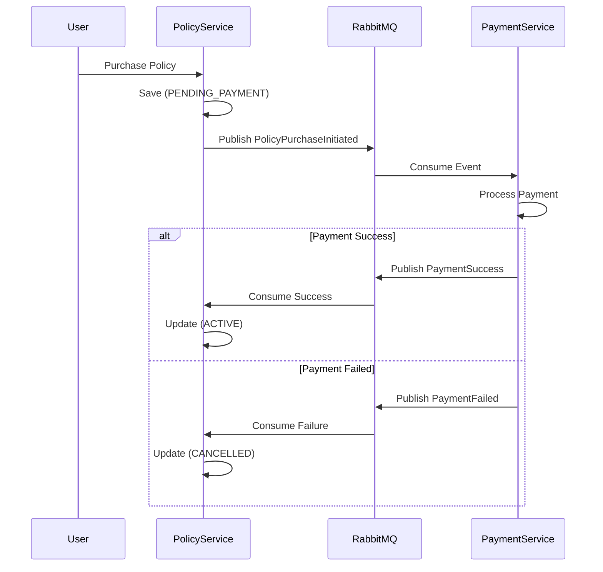

# Payment Service & Saga Pattern Design 💳

This document outlines the architectural design for a new **Payment Service** and the implementation of the **Saga Pattern** to ensure data consistency across `PolicyService`, `ClaimService`, and `PaymentService`.

---

## 1. Overview
In a microservices architecture, a single business process (like buying a policy) often spans multiple services. Traditional ACID transactions don't work across service boundaries. We use the **Saga Pattern** to manage these distributed transactions.

### Why Saga?
If a user pays for a policy but the `PolicyService` fails to activate it, we have an inconsistent state. The Saga pattern ensures that either the entire process completes or "Compensating Transactions" are triggered to undo partial work.

---

## 2. Policy Purchase Saga (Choreography-Based)

We will use **Choreography**, where services communicate via events (RabbitMQ) without a central orchestrator.

### The Flow:
1.  **PolicyService**: User requests purchase.
    - Create Policy record with status `PENDING_PAYMENT`.
    - Publish `PolicyPurchaseInitiatedEvent` to RabbitMQ.
2.  **PaymentService**: Listens for `PolicyPurchaseInitiatedEvent`.
    - Executes the actual payment logic (integrating with Stripe/PayPal).
    - **Success Path**: Publishes `PaymentSuccessEvent`.
    - **Failure Path**: Publishes `PaymentFailedEvent`.
3.  **PolicyService**: Listens for payment events.
    - **On `PaymentSuccessEvent`**: Update status to `ACTIVE`. The Saga is complete.
    - **On `PaymentFailedEvent`**: Update status to `CANCELLED`. This is the **Compensating Transaction**.

### Mermaid Diagram: Policy Saga


---

## 3. Claim Payout Saga

This ensures that once an admin approves a claim, the money is actually sent before the claim is marked as `PAID`.

### The Flow:
1.  **ClaimService**: Admin clicks "Approve".
    - Claim status moves to `APPROVED_PENDING_PAYOUT`.
    - Publish `ClaimApprovedEvent`.
2.  **PaymentService**: Listens for `ClaimApprovedEvent`.
    - Processes the bank transfer/payout to the customer.
    - **Success Path**: Publishes `PayoutSuccessEvent`.
    - **Failure Path**: Publishes `PayoutFailedEvent`.
3.  **ClaimService**:
    - **On `PayoutSuccessEvent`**: Move status to `PAID`.
    - **On `PayoutFailedEvent`**: Move status to `PAYOUT_ERROR`. Notify Admin for manual intervention.

---

## 4. Payment Service Architecture [NEW SERVICE]

### Tech Stack:
- **Framework**: Spring Boot 3
- **Database**: MySQL (Table: `payments`, `payouts`)
- **Messaging**: RabbitMQ
- **External Integration**: Stripe/Mock Payment Gateway

### Key Entities:
```java
@Entity
public class Payment {
    @Id @GeneratedValue private Long id;
    private Long policyId;
    private BigDecimal amount;
    private String transactionId;
    @Enumerated(EnumType.STRING)
    private PaymentStatus status; // INITIATED, SUCCESS, FAILED
}
```

---

## 5. Summary of Compensating Transactions

A compensating transaction is a "redo" or "undo" action.

| Action | Primary Transaction | Compensating Transaction |
| :--- | :--- | :--- |
| **Buy Policy** | Set status to `PENDING_PAYMENT` | Set status to `CANCELLED` |
| **Pay Premium** | Deduct money from User | Refund money to User (if activation fails) |
| **Approve Claim** | Set status to `APPROVED_PENDING` | Set status to `PAYOUT_ERROR` |

---

## 6. Implementation Steps

1.  **Create `PaymentService`**: Bootstrapping a new Spring Boot microservice.
2.  **Define Shared Events**: Create a shared library or duplicate DTOs for `PaymentSuccessEvent`, etc.
3.  **Update Policy/Claim Statuses**: Add new interim statuses like `PENDING_PAYMENT`.
4.  **Configure RabbitMQ**: Define exchanges and queues for the new events.
5.  **Develop Listeners**: Implement `@RabbitListener` in each service to handle the Saga transitions.

---
> [!IMPORTANT]
> **Data Consistency**: The Saga pattern guarantees **Eventual Consistency**. There will be a few seconds where the policy is in a "Pending" state before becoming active.
