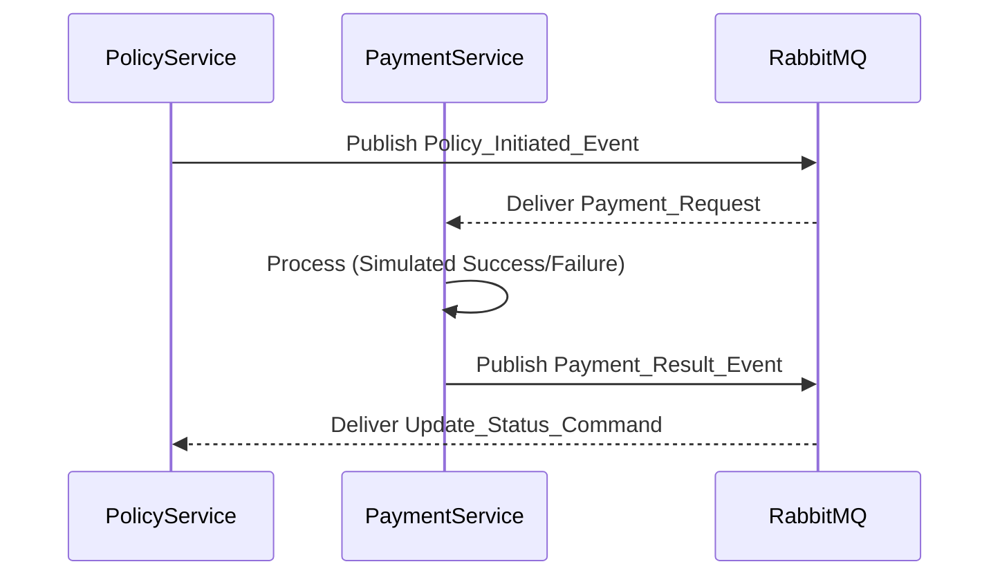

# SmartSure Technical Architecture: Microservices, Security, and Monitoring

This document provides a comprehensive technical reference for the SmartSure Insurance Management System.

---

## 1. CQRS (Command Query Responsibility Segregation) Analysis

### Evaluation: Implicit CQRS Pattern
While the system does not use a specialized CQRS framework (like Axon or MediatR), it implements **Implicit or Service-Level CQRS**.

### Why and How it is Used:
1.  **Segregation of DTOs**: 
    - The system uses separate **Request DTOs** (Commands) to capture user intent and **Response DTOs** (Queries/Projections) to return optimized data for the UI.
    - *Example*: `ClaimRequest` (Command) vs. `ClaimResponse` (Projection) in the `ClaimService`.
2.  **Aggregation in Admin Service**:
    - The `AdminService` acts as a read-heavy aggregator. It queries multiple microservices (Auth, Policy, Claim) and projects them into unified views for administrators. This offloads complex cross-domain queries from the individual business-logic services.
3.  **Read Optimization (Redis)**:
    - By using Spring Cache with Redis, the system segregates high-traffic read operations (Queries) from the main write-heavy persistence logic, ensuring that database load remains predictable during read spikes.

---

## 2. Infrastructure Registry (URLs)

| Component | Purpose | URL (Local) |
| :--- | :--- | :--- |
| **API Gateway** | Entry Point | [http://localhost:8080/](http://localhost:8080/) |
| **Prometheus** | Metric Scraping | [http://localhost:9090/](http://localhost:9090/) |
| **Grafana** | Monitoring Dashboard | [http://localhost:3000/](http://localhost:3000/) |
| **Service Registry** | Eureka Dashboard | [http://localhost:8761/](http://localhost:8761/) |
| **Centralized Swagger** | API Documentation Portal | [http://localhost:8080/swagger-ui.html](http://localhost:8080/swagger-ui.html) |
| **Actuator (Common)** | Health & Runtime Stats | `http://localhost:<port>/actuator` |

---

## 3. Microservice Layered Architecture & Component Inventory

Instead of generic definitions, here is a specific inventory of the core components within each microservice's architectural layers.

### 1. Auth Service (`AuthService`)
*   **DTOs**: `RegisterRequest`, `LoginRequest`, `AuthResponse`, `UserResponse`, `AddressRequest`, `UserUpdateRequest`.
*   **Entities**: `User`, `Role`, `Address`.
*   **Service Layer**: `AuthService` (JWT & Login), `UserService` (Profile mgmt), `AddressService`, `AdminSeeder`.
*   **Controller Layer**: `AuthController` (Public), `UserController` (Authenticated), `AddressController`.
*   **Messaging (RabbitMQ)**: `UserEventPublisher` (fires `USER_CREATED` events).

### 2. Policy Service (`PolicyService`)
*   **DTOs**: `PolicyPurchaseRequest`, `PolicyResponse`, `PolicyRenewalRequest`, `PolicySummaryResponse`, `PremiumCalculationRequest`, `PremiumResponse`.
*   **Entities**: `Policy`, `PolicyType`, `Premium`, `AuditLog`.
*   **Service Layer**: `PolicyService` (Core business logic), `PolicyTypeService`, `PremiumCalculator` (Internal engine), `NotificationPublisher`.
*   **Controller Layer**: `PolicyController`, `PolicyTypeController`, `PremiumController`.
*   **Feign Clients**: `AuthServiceClient` (for fetching customer details safely).

### 3. Claim Service (`claimService`)
*   **DTOs**: `ClaimRequest`, `ClaimResponse`, `UserResponseDto` (External), `PolicyDTO` (External).
*   **Entities**: `Claim`, `FileData` (Embeddable for documents), `Status` (Enum).
*   **Service Layer**: `ClaimService` (Manages document uploads and status lifecycle), `ClaimEventListener`.
*   **Controller Layer**: `ClaimController`.
*   **Messaging (RabbitMQ)**: `ClaimDecisionEvent` (published to notify customers and payment service).

### 4. Admin Service (`adminService`)
*   **DTOs**: `AuditLogDTO`, `ClaimDTO`, `PolicyDTO`, `UserDTO`, `ClaimStatusUpdateRequest`, `PolicyStatusUpdateRequest`.
*   **Entities**: `AuditLog` (Admin-specific audit trail).
*   **Service Layer**: `AdminService` (Orchestrates multi-service reads), `AuditLogService`.
*   **Controller Layer**: `AdminController` (Restricted to `ROLE_ADMIN`).
*   **Feign Clients**: `ClaimFeignClient`, `PolicyFeignClient`, `UserFeignClient`.

### 5. Payment Service (`paymentService`)
*   **DTOs**: `PaymentResult` (SAGA response), `PaymentRequest` (SAGA request).
*   **Entities**: `Payment`, `PaymentStatus` (Enum).
*   **Service Layer**: `PaymentService` (Simulation logic & state management).
*   **Controller Layer**: `PaymentController` (For manual transaction lookup).
*   **Messaging (RabbitMQ)**: `PaymentEventListener` (Listens for `POLICY_PAYMENT_REQ_QUEUE` and `CLAIM_PAYMENT_REQ_QUEUE`).

---

## 4. Security Architecture & Authorization

Security is implemented in a **Defense-in-Depth** model across the API Gateway and the individual services.

### A. Global Security (API Gateway)
- **Role**: First line of defense.
- **Mechanism**: `JwtAuthFilter` checks every incoming request for a valid `Authorization: Bearer <JWT>` header.
- **Routing**: If the token is valid, the Gateway attaches user claims to the header and routes the request.

### B. Inter-service Security
- **Internal Filters**: Services use `InternalRequestFilter` or `HeaderAuthenticationFilter` to ensure that requests either come from the Gateway or have valid internal credentials.

### C. Authorization Matrix:
| Pattern | Service | Required Role / Permission |
| :--- | :--- | :--- |
| `/api/auth/login` | Auth | Permit All |
| `/api/admin/**` | Admin | `ROLE_ADMIN` |
| `/api/policies/purchase`| Policy | `ROLE_CUSTOMER` |
| `/api/claims/submit` | Claim | `ROLE_CUSTOMER` |
| `/actuator/**` | All | Permit All (for Prometheus) |
| `/swagger-ui/**` | All | Permit All |

---

## 5. Payment Service: SAGA Implementation & Future Design

### Current Flow (Event-Choreography)
Presently, the `PaymentService` is decoupled. It listens for `payment.request` events and emits `payment.result` events.

### Future Design (Advanced SAGA)
In the next phase, the Payment Service will be integrated with **Compensation Logic** for the SAGA pattern.

1.  **Stateful Transactions**: Move from a stateless simulation to a persistent state machine tracking `PENDING_TXN` in the database.
2.  **Compensation Trigger**: If a payment fails (after 3 retries), the Payment Service will emit a `PAYMENT_FAILED_REVERSE` event.
3.  **Automated Rollback**: 
    - **Policy Service** will listen for `PAYMENT_FAILED_REVERSE` and mark the policy as `VOID_PAYMENT_FAILURE`.
    - **Claim Service** will listen and move an approved claim back to `PAYMENT_PENDING` or `REJECTED`.
4.  **Database Segregation**: Move `payment_db` to its own dedicated MySQL instance for true isolation.
5.  **Idempotency**: Implement `correlationId` tracking to prevent double-charging in multi-node payment gateways.

---

> [!IMPORTANT]
> This architecture is designed for **High Availability** and **Horizontal Scalability**. All services are stateless and rely on Eureka for discovery and RabbitMQ for resilient communication.
